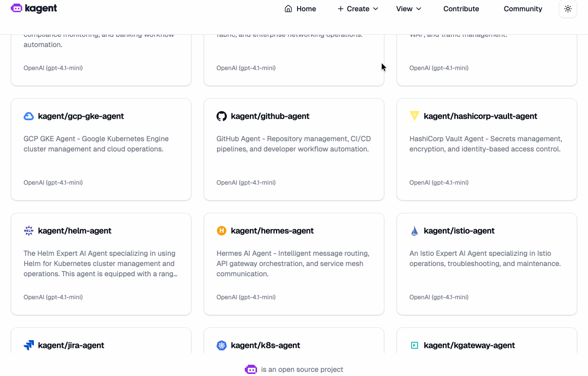
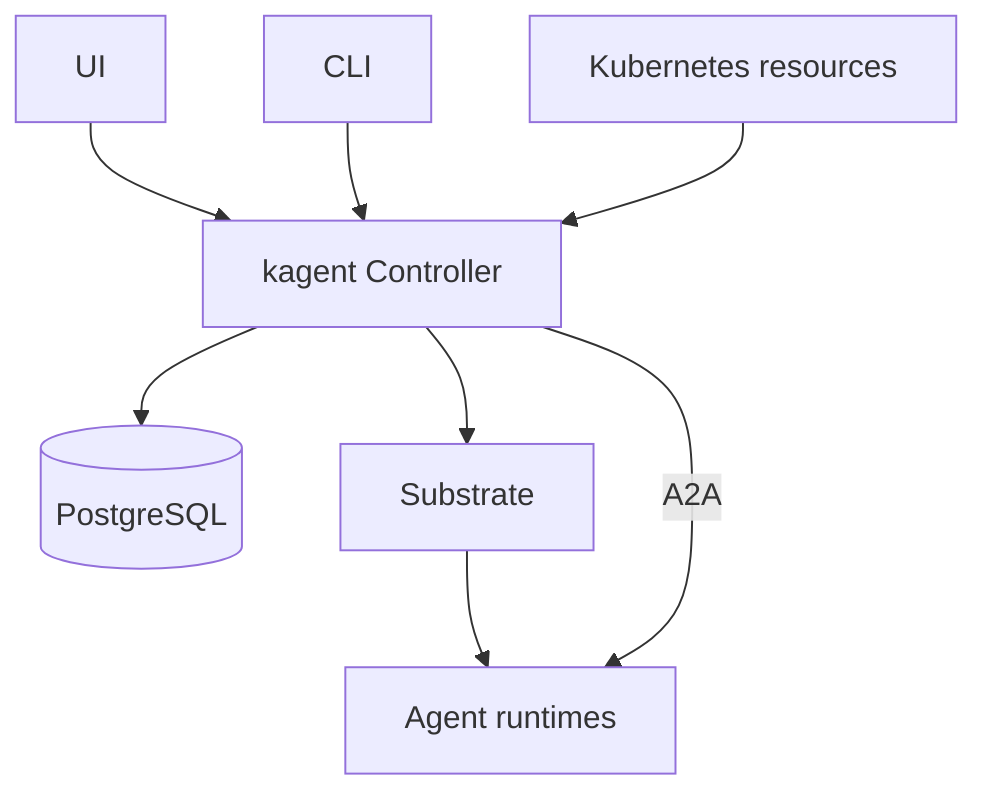

  <picture>
    <source media="(prefers-color-scheme: dark)" srcset="https://raw.githubusercontent.com/kagent-dev/kagent/main/img/icon-dark.svg" alt="kagent" width="400">
    <source media="(prefers-color-scheme: light)" srcset="https://raw.githubusercontent.com/kagent-dev/kagent/main/img/icon-light.svg" alt="kagent" width="400">
    
  </picture>
  

    
    
      
    
     
    
    
    
  

---

**kagent** is a Kubernetes native framework for building AI agents. Kubernetes is the most popular orchestration platform for running workloads, and **kagent** makes it easy to build, deploy and manage AI agents in Kubernetes. The **kagent** framework is designed to be easy to understand and use, and to provide a flexible and powerful way to build and manage AI agents.

  

---

<!-- markdownlint-disable MD033 -->
<table align="center">
  <tr>
    <td>
      <a href="#getting-started"><b><i>Getting Started</i></b></a>
    </td>
    <td>
      <a href="#technical-details"><b><i>Technical Details</i></b></a>
    </td>
    <td>
      <a href="#get-involved"><b><i>Get Involved</i></b></a>
    </td>
    <td>
      <a href="#reference"><b><i>Reference</i></b></a>
    </td>
  </tr>
</table>
<!-- markdownlint-enable MD033 -->

---

## Getting Started

- [Your first agent](https://kagent.dev/docs/kagent/1.x/get-started/your-first-agent/)
- [Installation guide](https://kagent.dev/docs/kagent/1.x/setup/installation/)

## Technical Details

### Core Concepts

- **Agents**: Agents are the main building block of kagent. An Agent is a Kubernetes custom resource that brings together an agent's behavior and runtime configuration.
- **Agent Templates**: A system prompt, a set of tools and subagents, and an LLM configuration define an agent's behavior. You can define this directly in an Agent or share it across agents using an AgentTemplate resource.
- **Harnesses**: A Harness defines how an agent runs. Kagent supports its own Go and Python ADKs, Codex, Claude, and custom runtimes, so you can choose the runtime that fits your agent.
- **LLM Providers**: Kagent supports multiple LLM providers, including [OpenAI](https://kagent.dev/docs/kagent/1.x/setup/model-providers/openai/), [Azure OpenAI](https://kagent.dev/docs/kagent/1.x/setup/model-providers/azure-openai/), [Anthropic](https://kagent.dev/docs/kagent/1.x/setup/model-providers/anthropic/), [Google Vertex AI](https://kagent.dev/docs/kagent/1.x/setup/model-providers/google-vertexai/), [Ollama](https://kagent.dev/docs/kagent/1.x/setup/model-providers/ollama/) and custom providers and models accessible via AI gateways. Models are configured through the ModelConfig resource, with provider support depending on the chosen Harness.
- **MCP Tools**: Agents can connect to MCP servers that provide tools. Kagent comes with an MCP server with tools for Kubernetes, Istio, Helm, Argo, Prometheus, Grafana, Cilium, and others. Agents connect through RemoteMCPServer resources, which can be shared across agents.
- **Sessions**: Sessions keep conversations and task history across interactions. You can suspend and resume an agent, or create a checkpoint and fork a new conversation from it.
- **Observability**: Kagent supports [OpenTelemetry tracing](https://kagent.dev/docs/kagent/1.x/observability/tracing/), which allows you to monitor what's happening with your agents and tools.

### Core Principles

- **Kubernetes Native**: Manage agent and tool configuration through Kubernetes APIs and familiar `kubectl` workflows.
- **Extensible**: Add custom tools, skills, and runtimes to connect agents to your own systems.
- **Flexible**: Choose the models and runtimes that fit your workload, and reuse agent templates across compatible harnesses.
- **Observable**: Trace agent, model, and tool execution with OpenTelemetry and your existing observability stack.
- **Declarative**: Define agents in YAML, keep configuration in version control, and deploy through GitOps workflows.
- **Testable**: Test agents through their public APIs and use task history and traces to diagnose failures.

### Architecture

Kagent brings together the following components:

- **Controller**: The controller watches kagent custom resources, prepares agents to run, and manages their sessions. It exposes gRPC, A2A, and MCP APIs for clients to interact with agents.
- **UI**: The UI is a web UI that allows you to manage agents and tools and chat with your agents.
- **Agent Runtimes**: Agents run using the Go or Python ADK, Codex, Claude, or a custom runtime, selected by their Harness.
- **Substrate**: Substrate runs the agents and manages their lifecycle, including suspension, resumption, and snapshots.
- **PostgreSQL**: PostgreSQL stores sessions, tasks, and conversation history so they persist independently of the running agents.
- **CLI**: The CLI is a command-line tool that allows you to manage agents and tools and interact with your agents.

For more details on the v1 architecture, including resource definitions and how agents run, see the [architecture guide](docs/architecture/README.md).

## Get Involved

_We welcome contributions! Contributors are expected to [respect the kagent Code of Conduct](https://github.com/kagent-dev/community/blob/main/CODE-OF-CONDUCT.md)_

There are many ways to get involved:

- 🐛 [Report bugs and issues](https://github.com/kagent-dev/kagent/issues/)
- 💡 [Suggest new features](https://github.com/kagent-dev/kagent/issues/)
- 📖 [Improve documentation](https://github.com/kagent-dev/website/)
- 🔧 [Submit pull requests](/CONTRIBUTING.md)
- ⭐ Star the repository
- 💬 [Help others in Discord](https://discord.gg/Fu3k65f2k3)
- 💬 [Join the kagent community meetings](https://calendar.google.com/calendar/u/0?cid=Y183OTI0OTdhNGU1N2NiNzVhNzE0Mjg0NWFkMzVkNTVmMTkxYTAwOWVhN2ZiN2E3ZTc5NDA5Yjk5NGJhOTRhMmVhQGdyb3VwLmNhbGVuZGFyLmdvb2dsZS5jb20)
- 🤝 [Share tips in the CNCF #kagent slack channel](https://cloud-native.slack.com/archives/C08ETST0076)
- 🔒 [Report security concerns](SECURITY.md)

### Roadmap

`kagent` is currently in active development. You can check out the full roadmap in the project Kanban board [here](https://github.com/orgs/kagent-dev/projects/3).

### Local development

For instructions on how to run everything locally, see the [DEVELOPMENT.md](DEVELOPMENT.md) file.

### Contributors

Thanks to all contributors who are helping to make kagent better.

### Star History

<a href="https://www.star-history.com/#kagent-dev/kagent&Date">
 <picture>
   <source media="(prefers-color-scheme: dark)" srcset="https://api.star-history.com/svg?repos=kagent-dev/kagent&type=Date&theme=dark" />
   <source media="(prefers-color-scheme: light)" srcset="https://api.star-history.com/svg?repos=kagent-dev/kagent&type=Date" />
   
 </picture>
</a>

## Reference

### License

This project is licensed under the [Apache 2.0 License.](/LICENSE)

---

    <picture>
      <source media="(prefers-color-scheme: dark)" srcset="https://raw.githubusercontent.com/cncf/artwork/refs/heads/main/other/cncf/horizontal/color-whitetext/cncf-color-whitetext.svg">
      <source media="(prefers-color-scheme: light)" srcset="https://raw.githubusercontent.com/cncf/artwork/refs/heads/main/other/cncf/horizontal/color/cncf-color.svg">
      
    </picture>
    
kagent is a <a href="https://cncf.io">Cloud Native Computing Foundation</a> project.

