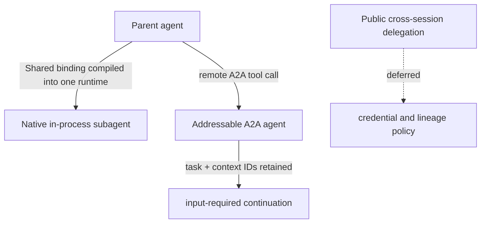

# A2A Agent Tools

Kagent has two distinct subagent mechanisms. They should not be confused.



## Shared agent tools

An `AgentTemplate` can bind another template as a Shared tool through `spec.tools[].subAgent.templateRef`. The
translator resolves the referenced template in the same compilation tree and
the selected harness compiler emits its native, in-process representation.
Kagent, Codex, and Claude support Shared bindings according to their runtime
capabilities.

For example, in an AgentTemplate spec (or an Agent's inline `template`):

```yaml
tools:
  - subAgent:
      name: reviewer
      description: Review proposed changes before applying them.
      templateRef:
        name: review-context
```

Tree resolution detects missing references and cycles before compilation.

## Dedicated agent tools

Dedicated bindings would select an independently configured Agent with its own
Harness and Session, invoked over A2A. This execution path is deferred. The
`agentRef` field is commented out in the source and absent from the served API;
subagent bindings currently require `templateRef`.

## Runtime remote A2A tools

The Go and Python ADKs also contain a remote A2A tool. Each call sends an A2A
message to an already-addressable remote agent and preserves the child task and
context IDs. If the child enters `input-required`, the parent can retain those
identifiers and continue the same child task after receiving human input.

Implementations:

- [`go/adk/pkg/tools/remote_a2a_tool.go`](../../go/adk/pkg/tools/remote_a2a_tool.go)
- [`python/packages/kagent-adk/src/kagent/adk/_remote_a2a_tool.py`](../../python/packages/kagent-adk/src/kagent/adk/_remote_a2a_tool.py)

This runtime helper is not public cross-Session delegation. Gateway-level
delegation still requires scoped credentials, lineage/depth/cycle enforcement,
and streamed child execution; that work remains deferred.
