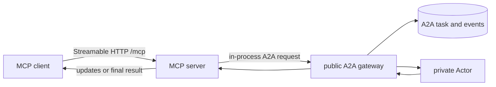

# MCP

Kagent exposes an authenticated, stateless Streamable HTTP MCP endpoint at
`/mcp` on the HTTP port (`8083`). It is another client of the public control-plane
semantics, not a private path to Actors.

Current tools can:

- list accessible Sessions;
- invoke a Session;
- create and list checkpoints;
- fork a Session from a checkpoint;
- discover SandboxTemplates and manage standalone Sandboxes; and
- run sandbox processes, read output, and transfer files.

## Client guidance

The server advertises instructions describing how to combine its tools. Sandbox
tool descriptions include next steps and constraints so tool-only clients also
receive the essential guidance. Clients decide whether to include server
instructions in model context; registering instructions does not force that.

When sandbox execution is available, the server also registers two MCP prompts:

| Prompt | Arguments | Purpose |
| --- | --- | --- |
| `sandbox-task` | Required `task`; optional `namespace` and `template` (template requires namespace) | Select an environment, stage inputs, execute, verify, retrieve artifacts, and clean up |
| `sandbox-recovery` | Required `sandbox_id` UUID | Inspect an interrupted task and identify how to continue without duplicating commands |

Clients discover prompts with `prompts/list` and retrieve messages with
`prompts/get`. Retrieval only renders guidance; it does not access resources or
execute tools. Prompts must be requested by a client and do not automatically
enter an agent's context. The Go ADK's current MCP toolset exposes tools, not
these prompt workflows.

Sandbox guidance covers the independent lifetime, current lack of allowed
egress, `/data/workspace`, base64 transfer limits, asynchronous process status,
output offsets, lifecycle retries, and artifact retrieval before deletion.
See [standalone sandboxes](sandboxes.md) for the runtime contract.

## Session invocation

Invocation calls the in-process public A2A gateway. Streaming MCP clients receive
updates from the same durable A2A task; synchronous clients drain the same stream
to completion.

## MCP Tasks

The server implements the MCP Tasks extension. An opaque base64 task reference
contains the authorized Session and A2A task identity.
`tasks/get`, `tasks/update`, and `tasks/cancel` translate to operations on that
same durable A2A task, including `input-required` continuation. There is no
separate MCP task or session store.

The implementation is in [`go/core/internal/mcp`](../../go/core/internal/mcp).
